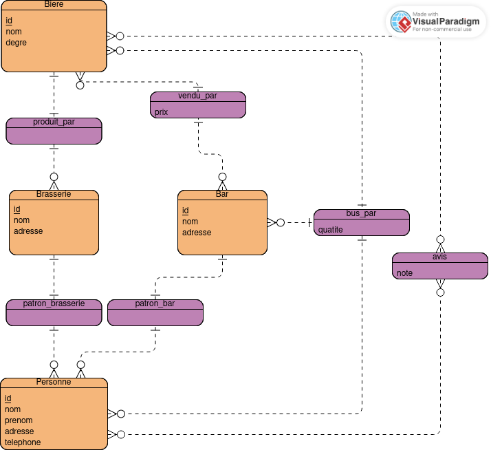

# Mini Projet SQL

 **Auteur :** Gaspard Vuillet

 ## Shema

$$ Personne (\underline{id}, nom, prenom, adresse, telephone)

\\Brasserie (\underline{id}, nom, adresse, patron)

\\Bar (\underline{id}, nom, adresse, patron)

\\Biere (\underline{id}, nom, degre )

\\Vend (\underline{bar,biere}, prix )

\\Bois (\underline{client, bar,biere}, quantite )

\\Avis (\underline{personne, bar}, note )$$

## Requetes
- recupration des buveurs : $\Pi_{nom,prenom}(Personne \bowtie_{Personne.id = Bois.client}Bois)$
- recuperation des nom de bars avec leur note moyenne dans l'ordre décroissant
- recuperation du client le plus aigris
- recuperation de la liste des personne qui on deja donner leur avis sur un bar ou ils ne sont jamais aller
- recuperation des patrons de bars qui ne boivent pas